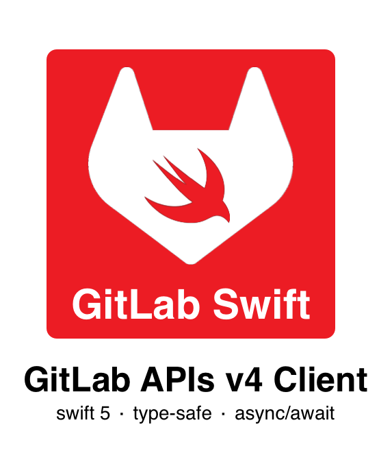

<p align="center">
<picture>
  <source media="(prefers-color-scheme: dark)" srcset="./Documentation/gitlabswift-dark-logo.png" width="350">
  
</picture>
</p


GitLabSwift is an async/await client to perform type-safe, multi-thread Swift call to the GitLab API services.  
It's effortless to use; below just a few examples:

```swift
// Configure your APIs service connector
let api = GitLab(config: .init(baseURL: "http://...", {
    $0.token = "<YOUR_PERSONAL_TOKEN>" // GitLab PAT
})

// SOME EXAMPLES

// Get your profile
let me: GLModel.User = try await gitlab.users.me()

// Get projects
let response = try await gitlab.projects.list(options: {
    $0.orderBy = .id
    $0.statistics = true
    $0.sort = .desc
})
            
// List some project's commits
let commits =try await gitlab.commits.list(project: anyProjectID, options: {
    $0.since = Date.oneWeekAgo()
    $0.until = Date.now
    $0.includeStats = true
})
```

Each API is available inside its namespace. Currently, this library supports:
- [Avatar](https://docs.gitlab.com/ee/api/avatar.html) - via `.avatar`
- [Branches](https://docs.gitlab.com/ee/api/branches.html) - via `.branches`
- [Branches (Protected)](https://docs.gitlab.com/ee/api/protected_branches.html) - via `.protectedBranches`
- [Commits](https://docs.gitlab.com/ee/api/commits.html) - via `.commits`)
- [Discussions](https://docs.gitlab.com/ee/api/discussions.html) - via `.discussions`
- [Epic Issues](https://docs.gitlab.com/ee/api/epic_issues.html) - via `.epicIssues`
- [Issues](https://docs.gitlab.com/ee/api/issues.html) - via `.issues`
- [IssuesStatistics](https://docs.gitlab.com/ee/api/issues_statistics.html) - via `.issuesStatistics`
- [Jobs](https://docs.gitlab.com/ee/api/jobs.html)) - via `.jobs`
- [Labels (Group)](https://docs.gitlab.com/ee/api/group_labels.html) - via `.groupLabels`
- [Labels (Project)](https://docs.gitlab.com/ee/api/labels.html#list-labels) - via `.labels`
- [Milestones (Group)](https://docs.gitlab.com/ee/api/group_milestones.html) - via `.milestones`
- [Milestones (Project)](https://docs.gitlab.com/ee/api/milestones.html) - via `.projectMilestones`
- [Pipelines](https://docs.gitlab.com/ee/api/pipelines.html) - via `.pipelines`
- [Projects](https://docs.gitlab.com/ee/api/projects.html)) - via `.projects`
- [Repositories](https://docs.gitlab.com/ee/api/repositories.html) - via `.repositories`
- [Repository Files](https://docs.gitlab.com/ee/api/repository_files.html) - via `.repositoryFiles`
- [Tags](https://docs.gitlab.com/ee/api/tags.html)) - via `.tags`
- [Users](https://docs.gitlab.com/ee/api/users.html) - via `.users`

> **Note**
> Not all API endpoints are supported. I tried to implement the most commonly used. Feel free to contribute by opening a new PR.

## Documentation

The usage of the library is pretty simple.  
First of all, you need to instantiate a new `GLApi` service which is the service used to communicate with your own GitLab instance:

```swift
let api = GitLab(config: .init(baseURL: "http://...", {
    $0.token = "<YOUR_PERSONAL_TOKEN>"
})
```

GitLabSwift supports Personal Access Tokens you can create directly from your GitLab instance profile.  
Once ready, each context is reachable by calling `gitlab.<context>.<api_call>`.  

Each endpoint is type-safe. When an API supports multiple options, an options callback is used where each parameter is type-safe.  
For example:

```swift
let response = try await gitlab.milestones.list(project: .id(1097), options: {
    // Each parameter is type-safe
    $0.includeParent = true
    $0.state = .activate
    $0.search = .beginWith("geo")
})
```

Each request return a generic object called `GLResponse`.  
This object allows you to identify any metadata of the request:

```swift
print("There are \(response.totalItems) in \(response.totalPages)"
print("Now showing \(response.countItemsPerPage) items per page")
```
You can also access the underlying data via `response.httpResponse` and the original request via `response.httpRequest`.

Since the result is an async throwing function, if an error occurs, a `GLErrors` is cached.

Most of the time, you're interested in getting the decoded objects. GitLabSwift uses `Codable` and each supported GitLab model is exposed via `GLModel` namespace.  
You just need to call `response.decode()` function to get the actual model instance from the response:

```swift
let tags: [GLModel.Tag] = try await gitlab.tags.list(
    project: .id(1097), 
    sort: .asc, 
    search: "release"
).decode()
// You will get an array of `Tags`!
for tag in tags {
    print("- Tag \(tag.name) from commit \(tag.commit.id) created on \(tag.commit.created_at)")
}
```

Starting from a response, you can easily move to the next pages:

```swift
let nextPageResponse = try await response.nextPage() // move forward
let prevPageResponse = try await response.prevPage() // move backward
let next3Pages = try await response.nextPages(3) // get the next 3 pages responses from current page of the response
let allRemainingPages = try await response.nextPages() // get all remaining pages
```
> **Note**
> These functions execute multiple async requests and return results at the end. If one of the calls fails, the entire flow fails.

## Requirements

GitLabSwift can be installed on any platform which supports:

- iOS 13+, macOS Catalina+, watchOS 6+, tvOS 13+
- Xcode 14+ 
- Swift 5.7+  

## Installation

### Swift Package Manager

Add it as a dependency in a Swift Package, and add it to your Package. Swift:

```swift
dependencies: [
  .package(url: "https://github.com/malcommac/GitLabSwift.git", from: "0.9.0")
]
```

And add it as a dependency of your target:

```swift
targets: [
  .target(name: "MyTarget", dependencies: [
    .product(name: "https://github.com/malcommac/GitLabSwift.git", package: "GitLabSwift")
  ])
]
```

## Author

GitLabSwift is currently owned and maintained by Daniele Margutti.

- 🐦 on twitter [@danielemargutti](http://twitter.com/danielemargutti/)).
- 👩‍💻 on my web site [www.danielemargutti.com](https://www.danielemargutti.com)
- 💼 on LinkedIn [Daniele Margutti](http://linkedin.com/in/danielemargutti/)

## License

This software is licensed under MIT License.
